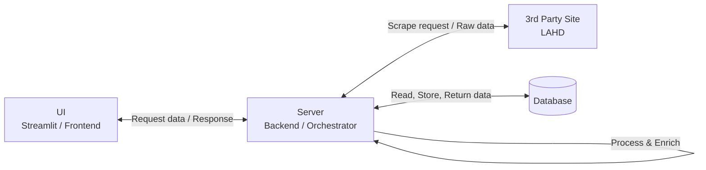
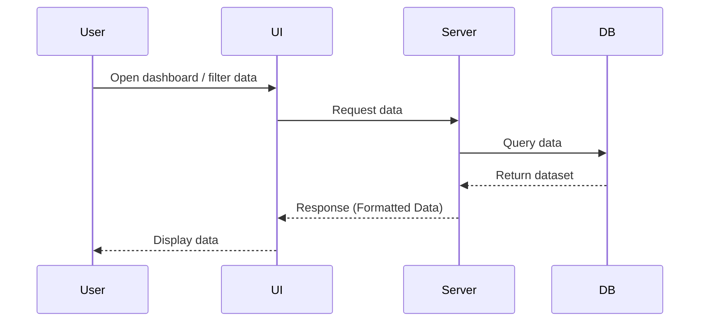
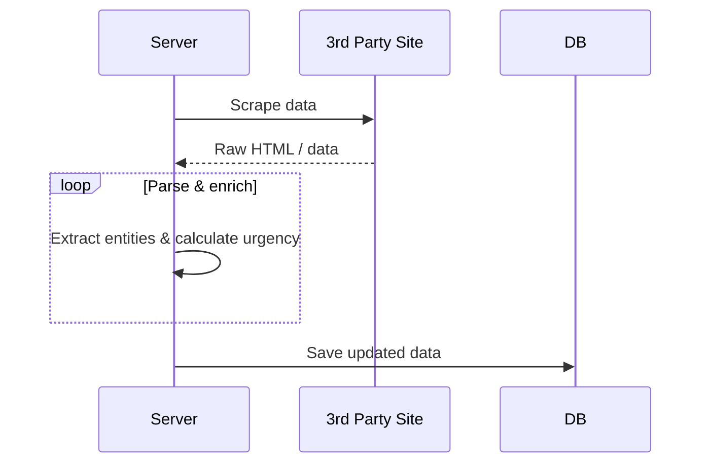

# 📑 High-Level Design (HLD) - LA Property Monitor

## 1. Background & Motivation
Property Management in Los Angeles requires strict adherence to LAHD (Housing Department) standards. Manually tracking fragmented data leads to delayed responses and high legal risks. 

**The Goal:** To design a modular, automated system that will transform raw municipal data into a prioritized executive dashboard, ensuring no compliance deadline is missed.

---

## 2. System Architecture & Flow Description
The system will be composed of three main internal components and one external interface. The architecture is designed to decouple data acquisition from data presentation, ensuring high availability and scalability.

* **UI (Frontend):** The user-facing dashboard that will display interactive data and allow filtering.
* **Server (Backend / Orchestrator):** The core engine that will manage requests, orchestrate scraping, parse raw HTML, and apply business logic (enrichment).
* **Database (DB):** The persistence layer that will store structured property and case data.
* **3rd Party Site (LAHD):** The external municipal portal from which raw data will be sourced.

###  Component Diagram

## 3. Sequence Diagrams: System Flows
The system operations will be divided into two distinct flows to ensure UI responsiveness and data integrity. The scraping process is decoupled from the user session.

### Flow A: Data Presentation (User Read Flow)
This flow describes how the user will interact with the dashboard to view pre-processed, enriched data directly from the database, ensuring zero latency from 3rd-party network requests.

### Flow B: Data Acquisition (Scraping Flow)
 **On-Demand Sync with Cache:**
* **Cache miss:** If the property data does not exist in the local Database, the Server triggers an immediate scrape from the LAHD portal.

* **Manual Refresh:** The UI provides an option for the user to force an update of existing records to ensure data parity with the source.

## 4. Component Design
This section outlines the planned internal structure, responsibilities, and implementation strategies for each major component.

### 4.1 Server (Backend/Orchestrator)
The server component will be built using **Clean Architecture** principles, specifically adhering to the **Open/Closed Principle**. This ensures the system can be easily extended (e.g., adding new data sources, municipalities, or urgency rules) without modifying the core orchestration logic.

* **Scraping Service:** Will handle HTTP requests, session management, and rate-limiting against the LAHD portal.
* **Parsing Service:** Will extract DOM elements into raw structured data independently of the business rules.
* **Business Processor:** Will implement enrichment logic, including a 14-day rolling window to flag records as "New" and a mapping engine for "Urgency" levels. To ensure data-code separation, status explanations and mapping rules will be stored in an external JSON configuration file.

### 4.2 Database (Persistence Layer)
The system will utilize a relational database (e.g., SQLite for MVP, structured to easily migrate to PostgreSQL for production). It will implement the **Repository Pattern** to abstract SQL queries from the Server logic.

#### Table: `properties` (Master Data)
Will store core asset information.
* **Fields:** `apn`, `address`, `total_units`, `regional_office`, `last_updated`.

#### Table: `cases` (Transactional Data)
Will store ongoing and historical legal events.
* **Fields:** `case_number`, `property_apn`, `type`, `status`, `nature`, `current_step`, `opened_date`, `deadline_date`, and calculated fields like `urgency` and `is_new`.

### 4.3 UI (Frontend)
The user interface will be built to provide immediate visual cues for risk management, prioritizing user experience and quick decision-making.

* **Components:** Will include dynamic search filters and an interactive data grid.
* **Visual Logic:** The grid will utilize custom client-side styling to color-code rows (**Critical**, **Warning**, **Safe**) based on the Server's dynamically calculated `urgency` field.

---

## 5. Design Decisions & Trade-offs

* **On-Demand vs. Scheduled Sync:**  The current version implements On-Demand synchronization to ensure the user gets data immediately if it's missing. However, to optimize UI responsiveness and avoid potential blocking by the LAHD portal, the system is designed to transition into a Scheduled Background Task in future iterations. This will allow the dashboard to serve data exclusively from the local cache, eliminating wait times during user sessions.

* **Flat vs. Grouped View:** During the initial data analysis phase, grouping records by `Case Number` was evaluated to provide a unified lifecycle. However, edge cases were identified where multiple active processes exist for a single ID (sharing the exact same open date, confirming they stem from the same event). To ensure 100% transparency and prevent data loss, the planned approach will utilize a **Granular Flat View**. A hierarchical "Parent-Child" UI is planned for future iterations to balance clarity and detail.

## 6. Implementation & QA Strategy
* **Unit Testing:** Focus on parsing accuracy by using local HTML mocks to verify the extraction logic without network dependency.
* **Integration Testing:** Verification of the End-to-End flow, from the Scraper triggering to successful database persistence.
* **UI Verification:** Testing search filter responsiveness and conditional row styling in the interactive grid.

